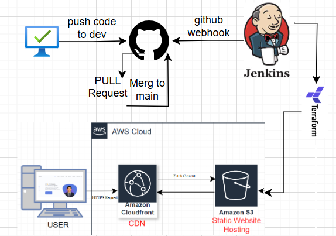

# Portfolio Hosting with S3 and CloudFront (Terraform)

This project hosts a static portfolio website using AWS S3 and CloudFront, managed via Terraform.

## 🧱 Infrastructure

- **Amazon S3**: Hosts the static website.
- **Amazon CloudFront**: Serves content via a global CDN.
- **Terraform**: Infrastructure as code.

## 🚀 Deployment Steps

1. Clone the repo.
```bash 
git clone https://github.com/Tahseenullahihsan/portfolio-on-s3-cloudfront.git
```
---

2. Run Terraform:
```
    terraform init
```
3. Validate terraform
```
terraform validate
```
4. Apply  the terraform

    terraform apply

3. Deploy portfolio files:
    ```bash
    ./deploy.sh  # or your actual script name
    ```

## 🌐 Architecture Diagram



